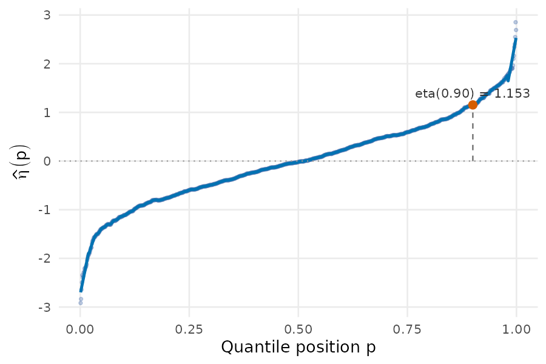
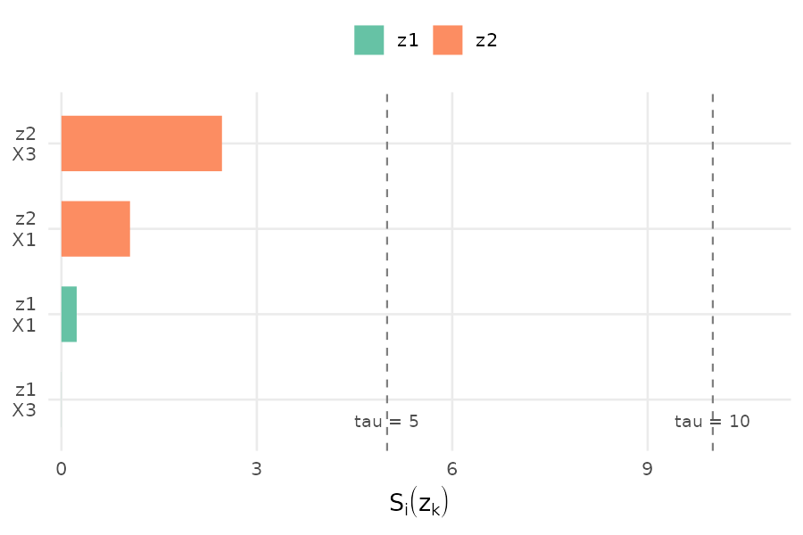
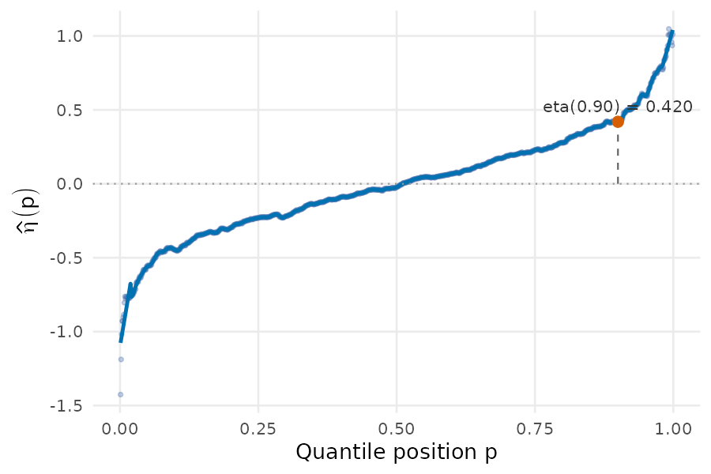
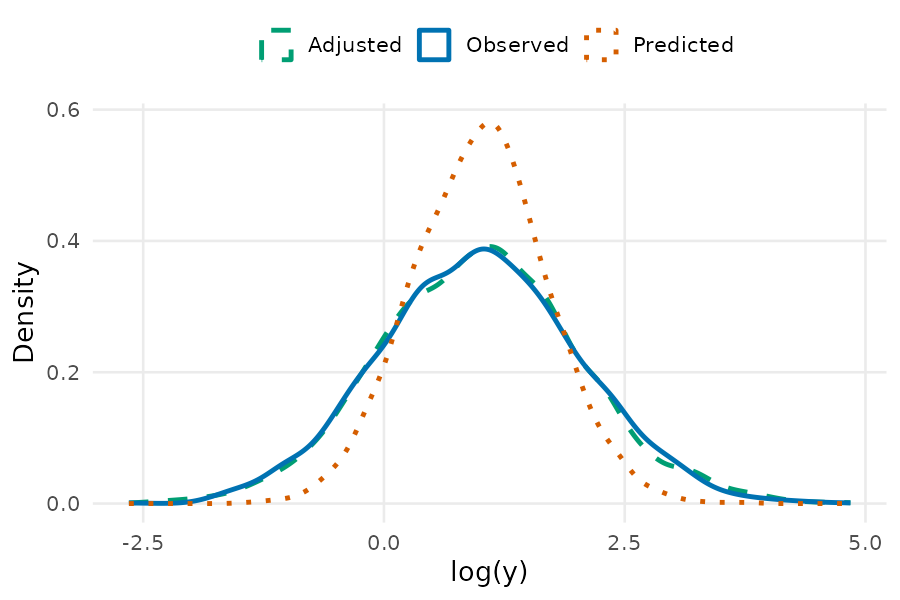

# tstsqa

Bias reduction for two-sample two-stage (TSTS) survey-to-survey imputation
via quantile adjustment, implementing the method described in Torres-Lopez,
*"Bias Reduction in TSTSLS Applications: A Quantile Adjustment Method."*

## What the method does

Suppose you want to study the relationship between income ($y$) and another
variable ($z$), such as consumption, wealth, or parental income, but no
single survey observes both. A donor sample has $y$ and predictors $X$; a
target sample has $z$ and the same $X$, but never $y$ and $z$ together. The
standard approach fits a model for $y$ on $X$ in the donor sample and uses
it to impute $y$ in the target sample.

That imputation carries two distinct biases. Because the prediction
$\hat y$ is a conditional expectation, its variance is mechanically smaller
than the true variance of $y$:

$$\text{Var}(\hat y) = R^2 \cdot \text{Var}(y)$$

so the imputed distribution ends up compressed relative to the truth. At
the same time, whatever part of $y$ is not explained by $X$ is dropped
entirely from the imputation, which biases its covariance with $z$ as well:

$$\text{Cov}(y, z) = \text{Cov}(\hat y, z) + \text{Cov}(\varepsilon, z)$$

only the first term on the right is ever recovered. Rescaling the variance
(stochastic augmentation) fixes the first problem but not the second.
Quantile adjustment fixes both by shifting each imputed value according to
the gap between the observed and predicted quantile functions at that
value's rank:

$$\eta(p) = Q_y(p) - Q_{\hat y}(p)$$

This restores the full donor distribution exactly, and because the
correction tracks each observation's position in the predicted-income
ranking, it can also shift the imputed covariance with $z$ toward the
truth. Whether it helps or hurts depends on how well the chosen predictors
align with both $y$ and $z$. `qa_diagnose()`, below, checks that before you
run the adjustment.

## Installation

```r
# install.packages("devtools")
devtools::install_github("PedroToL/tstsqa")
```

## Toy example

### 1. Fit the adjustment with `qa_fit()`

```r
library(tstsqa)

set.seed(123)
n <- 5000
X <- rnorm(n)
y <- exp(1 + 0.8 * X + rnorm(n, sd = 1.5))   # substantial unexplained variance

donor  <- data.frame(y = y[1:2500], X = X[1:2500])
target <- data.frame(X = X[2501:5000])

result <- qa_fit(donor, target, y_var = "y", x_vars = "X", outcome_scale = "log",
                  plotting = TRUE, annotate_p = 0.9)

head(result$y_adjusted)
#> [1]  0.867  7.353  0.831  1.082 10.041  1.187

result$eta_plot
```

<p align="center">

</p>

`result$y_adjusted` holds the corrected imputed values for the target
sample. `result$eta_plot` (above) shows the quantile-gap function
$\hat\eta(p)$ that produced them: the raw grid estimates as points, the
smoothed curve used internally, and, since `annotate_p = 0.9`, the exact
adjustment applied at the 90th percentile.

### 2. Screen predictors and estimate the regime with `qa_diagnose()`

Adding a predictor doesn't always help: one that predicts $z$ well but adds
little to predicting $y$ can inflate the correction beyond what's
justified. `qa_diagnose()` screens candidate predictors against this
failure mode by bootstrap, then bootstraps $R^2_{y,d}$ and $\rho^*$ for the
survivors, each with a 95% CI rather than a single point estimate.

```r
set.seed(7)
n2 <- 10000
X1 <- rnorm(n2); X2 <- rnorm(n2); X3 <- rnorm(n2)

y2 <- exp(1 + 0.6 * X1 + 0.4 * X3 + rnorm(n2, sd = 0.8))   # X2 barely predicts y
z1 <- 0.3 * X1 + 0.9 * X2 + rnorm(n2, sd = 0.5)            # ...but strongly predicts z1
z2 <- 0.5 * X1 + 0.5 * X3 + rnorm(n2, sd = 0.5)

donor2  <- data.frame(y = y2[1:5000], X1 = X1[1:5000], X2 = X2[1:5000], X3 = X3[1:5000])
target2 <- data.frame(X1 = X1[5001:10000], X2 = X2[5001:10000], X3 = X3[5001:10000],
                       z1 = z1[5001:10000], z2 = z2[5001:10000])

diagnosis <- qa_diagnose(donor2, target2, y_var = "y", z_vars = c("z1", "z2"),
                          x_vars = c("X1", "X2", "X3"), B = 30, plotting = TRUE)
#> Outcome scale: log
#> ========== Variable Selection ==========
#>
#> --- Iteration 1 ---
#> Variables: X1, X2, X3
#> Bootstrap progress: 1/30 (3%) - ETA: -- ... 30/30 (100%) - ETA: 0s
#> Top 5 S_i(z_k) pairs (mean, 95% CI across 30 subsamples):
#>  predictor z_var       mean_S     ci_lower     ci_upper
#>         X2    z1 2708.3087955 493.52607164 1.577892e+04
#>         X3    z2    2.4326821   2.21827069 2.666602e+00
#>         X2    z2    2.2685998   0.06162247 2.237798e+01
#>         X1    z2    1.0571185   0.99256450 1.140386e+00
#>         X1    z1    0.2465681   0.22015387 2.654167e-01
#>
#> At least one pair exceeds tau = 10.0: mean S(X2, z1) = 2708.31
#> Removing 'X2'.
#>
#> --- Iteration 2 ---
#> Variables: X1, X3
#> Bootstrap progress: 1/30 (3%) - ETA: -- ... 30/30 (100%) - ETA: 0s
#> Top 4 S_i(z_k) pairs (mean, 95% CI across 30 subsamples):
#>  predictor z_var      mean_S     ci_lower    ci_upper
#>         X3    z2 2.464832776 2.223415e+00 2.673477826
#>         X1    z2 1.053180132 9.681558e-01 1.162441546
#>         X1    z1 0.234582455 1.969436e-01 0.276808184
#>         X3    z1 0.001597067 1.488534e-05 0.007081496
#>
#> No pair exceeds tau = 10.0. Variable selection converged.
#>
#> Stage 1 survivors: X1, X3
#>
#> ========== Final Estimation ==========
#> Bootstrap progress: 1/30 (3%) - ETA: -- ... 30/30 (100%) - ETA: 0s
#> R^2_y,d: mean = 0.4398, 95% CI [0.4216, 0.4594]
#>
#> rho*:
#>  z_var   mean ci_lower ci_upper
#>     z1 0.1069   0.0942   0.1205
#>     z2 0.6369   0.6074   0.6647

diagnosis$S_plot
```

<p align="center">

</p>

`X2` gets screened out: it inflates the correction for `z1` far more than
it improves the fit for `y`. `X1` and `X3` survive, both comfortably under
the screening thresholds shown as dashed lines. `diagnosis$R2_y_donor` and
`diagnosis$rho_star` each hold `mean`/`ci_lower`/`ci_upper`: the first-stage
fit quality and, for each `z`, the residual correlation at which the
adjustment would exactly recover the true covariance.

### 3. Refit explicitly on the selected predictors

`qa_diagnose()` tells you which predictors to use. The donor sample is the
only place we can check the first stage's predictions against reality
directly, since $y$ is never observed in the target sample, so this refit
splits the donor sample itself into a training half and a held-out half:

```r
donor_train   <- donor2[1:2500, ]
donor_holdout <- donor2[2501:5000, ]

final_fit <- qa_fit(donor_train, donor_holdout, y_var = "y",
                     x_vars = diagnosis$selected_predictors,
                     outcome_scale = "log", plotting = TRUE, annotate_p = 0.9)

final_fit$eta_plot
```

<p align="center">

</p>

`final_fit` was fit only on `donor_train`, then applied to `donor_holdout`
as if it were the target sample. Because `donor_holdout` is still donor
data, its true `y` is known, which makes it possible to compare three
things directly: the observed values, the raw (uncorrected) predictions,
and the quantile-adjusted predictions.

```r
observed_log_y  <- log(donor_holdout$y)
predicted_log_y <- final_fit$y_hat_target       # already on the log scale
adjusted_log_y  <- log(final_fit$y_adjusted)    # y_adjusted is on the level scale

round(c(observed = var(observed_log_y), predicted = var(predicted_log_y),
        adjusted = var(adjusted_log_y)), 3)
#> observed predicted  adjusted
#>    1.071     0.486     1.091

density_df <- data.frame(
  log_y = c(observed_log_y, predicted_log_y, adjusted_log_y),
  type  = rep(c("Observed", "Predicted", "Adjusted"), each = length(observed_log_y))
)

ggplot2::ggplot(density_df, ggplot2::aes(log_y, color = type, linetype = type)) +
  ggplot2::geom_density(linewidth = 1.1) +
  ggplot2::scale_linetype_manual(values = c(Observed = "solid", Predicted = "dotted",
                                              Adjusted = "dashed"))
```

<p align="center">

</p>

The raw predicted distribution is visibly more peaked and thinner-tailed
than the observed one: that gap is the variance bias described above. The
adjusted distribution sits almost exactly on top of the observed one,
recovering both its variance and its shape, on data the adjustment never
saw during fitting.

See `?qa_fit` and `?qa_diagnose` for full argument documentation.

## License

MIT © Pedro J. Torres-Lopez
